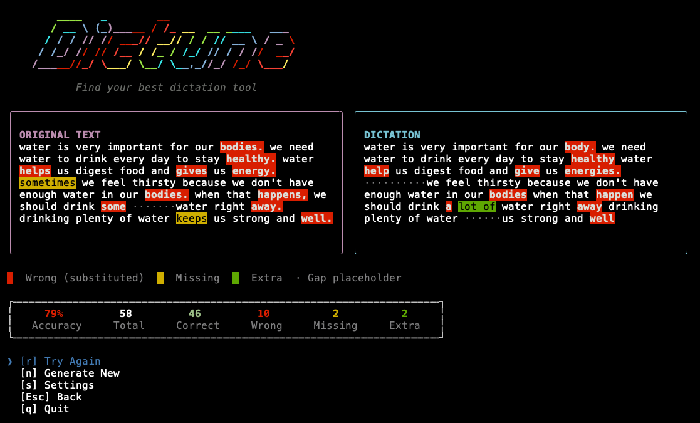

<p align="center">
  
</p>

<p align="center"><strong>Find your best dictation tool</strong></p>

<p align="center">
Generate texts using AI, read them aloud using different dictation tools, and compare results to find which transcriber hears you best.
</p>


## Web App


Try it now at the [github page](https://cunlianggeng.github.io/dictune/) — works offline after the first load.

 **Chrome** or **Firefox** are recommended for best AI compatibility. Safari users can still use the in-browser AI, but self-hosted AI servers won't directly work due to Safari's restrictions.

## Terminal App



Install with one command (Linux & macOS):

```bash
curl -fsSL https://raw.githubusercontent.com/CunliangGeng/dictune/main/install.sh | bash
```

Or download a binary manually from [GitHub Releases](https://github.com/CunliangGeng/dictune/releases/latest): available for Linux (x64, arm64), macOS (x64, arm64), and Windows (x64).

To start the terminal app, run the command:

```bash
dictune
```

To update to the latest version, run the command:

```bash
dictune update
```

To uninstall, run the command:

```bash
dictune uninstall
```

## AI Providers

- **In-browser AI** (Web app only): Runs locally in your browser via WebLLM + WebGPU. Downloads specified Qwen3 model once, then works fully offline. **Desktop only** — mobile and tablet devices are not supported due to WebGPU limitations on mobile browsers.
- **Local or Cloud AI**: Connect to any OpenAI-compatible endpoint — self-hosted (Ollama, LM Studio, Jan, etc.) or cloud (OpenAI, Anthropic, Google Gemini, Mistral AI, DeepSeek, Together AI, Groq, etc.)


> [!TIP]
> In-browser AI is the most convenient option, but local or cloud AI servers could provide better quality results. Try different providers and models to see which one works best for you.

### CORS Setup for Self-Hosted Servers

`Failed to fetch` errors occur when the web app tries to access a local AI server that doesn't allow cross-origin requests from the app's domain. To fix this, configure your AI server to allow requests from `https://cunlianggeng.github.io`. See the table below for specific setup instructions for popular servers:

| Server | Setup |
|--------|-------|
| **Ollama** | `OLLAMA_ORIGINS=https://cunlianggeng.github.io ollama serve` |
| **LM Studio** | Enable CORS in Developer settings, set allowed origin |
| **Jan** | CORS enabled by default — no action needed |
| **GPT4All** | Enable API server in settings |
| **LocalAI** | Launch with `--cors-allow-origins https://cunlianggeng.github.io` |
| **llama.cpp** | Launch with `--cors-allow-origin https://cunlianggeng.github.io` |
| **vLLM** | Launch with `--allowed-origins https://cunlianggeng.github.io` |

## License
MIT