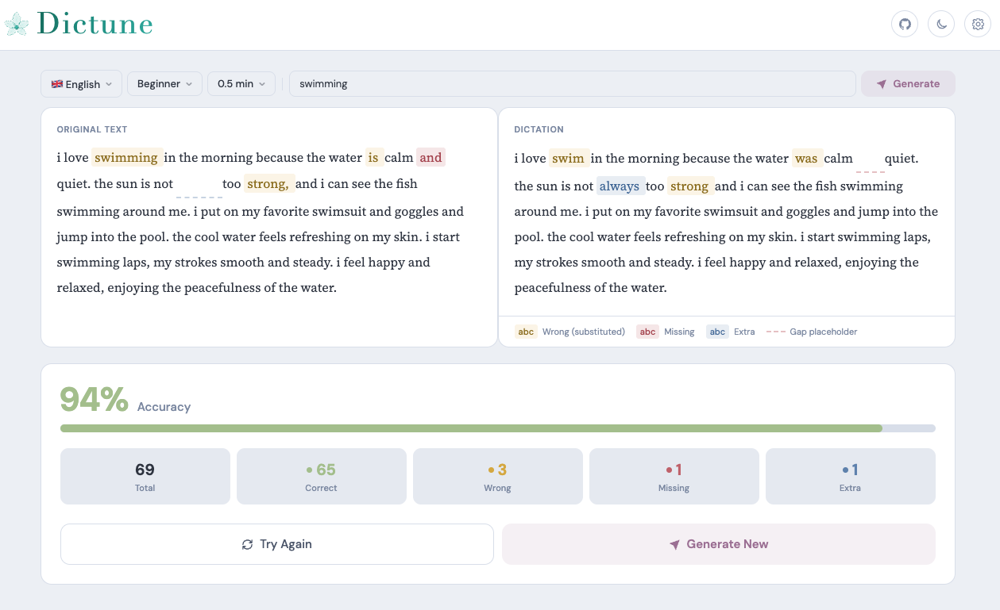

<p align="center">
  
</p>

<p align="center"><strong>Find your best dictation tool</strong></p>

<p align="center">
Generate texts using AI, read them aloud using different dictation tools, and compare results to find which transcriber hears you best.
</p>



## Web App

Try it now at the [github page](https://cunlianggeng.github.io/dictune/) — works offline after the first load.

To install as an app on your device, open the site and:
- **Chrome / Edge**: Click the install icon in the address bar, or Menu → "Install Dictune"
- **Safari (iOS)**: Tap Share → "Add to Home Screen"

## Terminal App

Install with one command (Linux & macOS):

```bash
curl -fsSL https://raw.githubusercontent.com/CunliangGeng/dictune/main/install.sh | bash
```

Or download a binary manually from [GitHub Releases](https://github.com/CunliangGeng/dictune/releases/latest). Available for Linux (x64, arm64), macOS (x64, arm64), and Windows (x64).

## AI Providers

- **In-browser AI** (Web app only): Runs locally in your browser via WebLLM + WebGPU. Downloads Qwen3 models once, then works fully offline.
- **Local or Cloud AI**: Connect to any OpenAI-compatible endpoint — self-hosted (Ollama, LM Studio, Jan, etc.) or cloud (OpenAI, Anthropic, Google Gemini, Mistral AI, DeepSeek, Together AI, Groq, etc.)